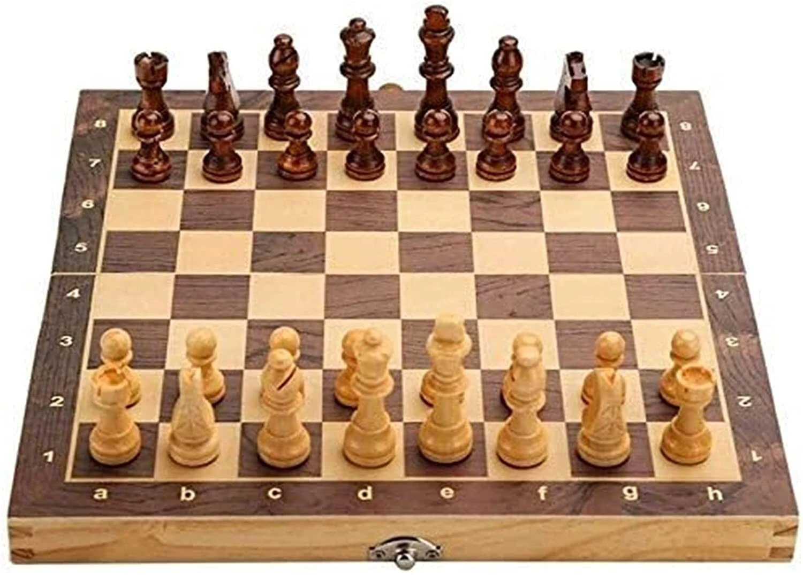

# ♟️ Golang Chess CLI

A command-line chess game written in Go, with support for playing against another person or the Stockfish chess engine.



## Features

- Play chess entirely from your terminal
- Play against another person locally
- Play against the Stockfish engine
- Board rendered with Unicode chess pieces
- Move input via standard chess notation (e.g. `e2e4`) or special notation for castling (`O-O`, `O-O-O`)

## Demo

```
Welcome to the chess game cli
Please select the color you'll be playing w for white, b for black:
Color to play: b
Please select who to play against: person or stockfish:
Play Against: stockfish

        a  b  c  d  e  f  g  h
8      [♜][♞][♝][♛][♚][♝][♞][♜]
7      [♟][♟][♟][♟][♟][♟][♟][♟]
6      [ ][ ][ ][ ][ ][ ][ ][ ]
5      [ ][ ][ ][ ][ ][ ][ ][ ]
4      [ ][ ][ ][ ][ ][ ][ ][ ]
3      [ ][ ][ ][ ][ ][ ][ ][ ]
2      [♙][♙][♙][♙][♙][♙][♙][♙]
1      [♖][♘][♗][♕][♔][♗][♘][♖]
        a  b  c  d  e  f  g  h
```

## Prerequisites

- [Go](https://golang.org/dl/) 1.20 or higher
- Stockfish engine (required for playing against the computer — see below)

## Installing Stockfish

### macOS

```bash
brew install stockfish
```

### Ubuntu / Debian

```bash
sudo apt update
sudo apt install stockfish
```

### Windows

1. Download the latest Stockfish binary from [https://stockfishchess.org/download/](https://stockfishchess.org/download/)
2. Extract the zip file
3. Move the `stockfish.exe` binary to a folder of your choice
4. Add that folder to your system PATH, or place the binary directly in the project root

### Verify Installation

```bash
stockfish
```

You should see the Stockfish prompt. Type `quit` to exit.

### Configuring the Engine Path

After installing Stockfish, update the path in your `.env` file at the project root:

```env
STOCKFISH_PATH=/usr/local/bin/stockfish
```

Replace the value with the actual path to your Stockfish binary (use `which stockfish` on macOS/Linux to find it).

## Installation

```bash
git clone https://github.com/Glenn444/golang-chess.git
cd golang-chess
go mod tidy
```

## Running the Game

```bash
cd cli
go run main.go
```

## How to Play

When prompted, select your color (`w` for white, `b` for black) and your opponent (`person` or `stockfish`).

Enter moves using coordinate notation:

| Move Type | Example |
|-----------|---------|
| Regular move | `e2e4` |
| Kingside castle | `O-O` or `e1g1` (white), `e8g8` (black) |
| Queenside castle | `O-O-O` or `e1c1` (white), `e8c8` (black) |

## Project Structure

```
golang-chess/
├── cli/
│   └── internal/
│       ├── board/       # Board logic and move handling
│       ├── cli/         # CLI input/output
│       ├── pieces/      # Piece definitions and game state
│       └── stockfish/   # Stockfish engine integration
├── utils/               # Helper utilities
├── main.go
├── go.mod
└── .env
```

## Roadmap

- [ ] Full castling validation (check, through-check, piece-moved tracking)
- [ ] En passant
- [ ] Pawn promotion
- [ ] Check and checkmate detection
- [ ] Game history and PGN export

## License

MIT